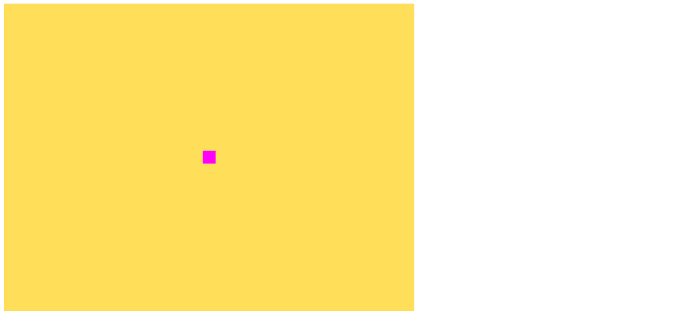

# Belajar-WebGL
Repositori kelas untuk pembelajaran dasar pemrograman WebGL

## Pertemuan 2 (8 Oktober 2020)

### Media Pembelajaran
Discord Voice Channel & Visual Studio Code Live Share

### Target Tercapai
Berhasil membuat titik pada kanvas melalui context. Di dalamnya sudah *include* penggunaan ***Vertex Shader*** dan
***Fragment Shader***. Hasil dapat dilihat melalui [index.html](pertemuan-2/index.html). Tampilan akan muncul seperti gambar di bawah ini:

### Kesulitan
Karena terbiasa menggunakan warna dengan format *Hexadecimal* (#ffffff untuk putih dan #000000 untuk hitam) dan format *Decimal* (rgb(255,255,255) untuk putih dan rgb(0,0,0) untuk hitam), maka saya menemui sedikit kesulitan saat memasukkan warna dalam format persentase. Solusinya adalah dengan menggunakan aplikasi atau situs *third-party* untuk mengonversikan warna-warna dalam bentuk *hexadecimal* atau *decimal* ke dalam bentuk persentase.