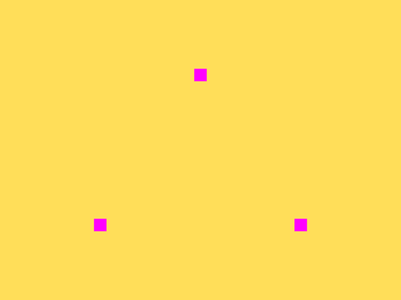
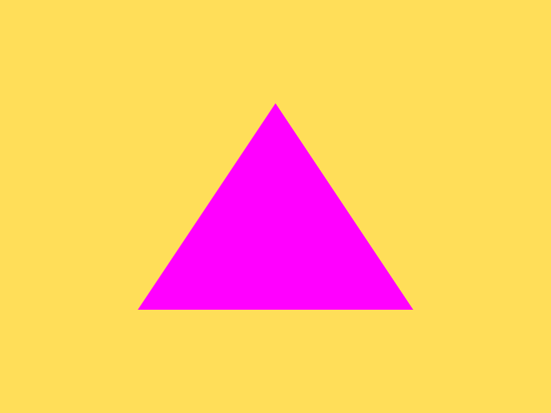
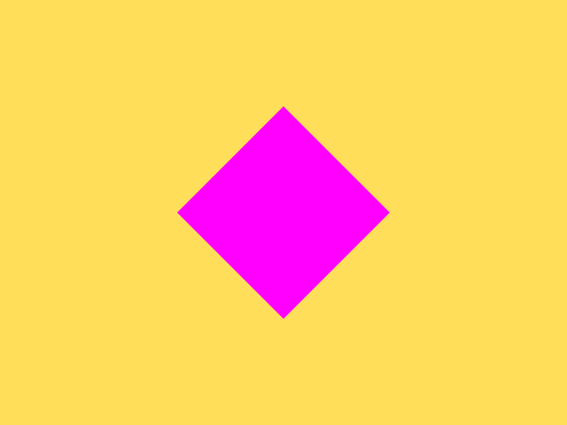
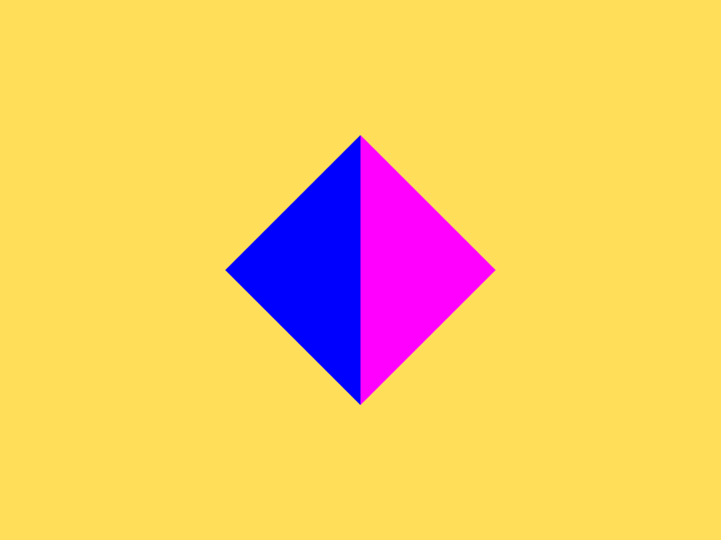
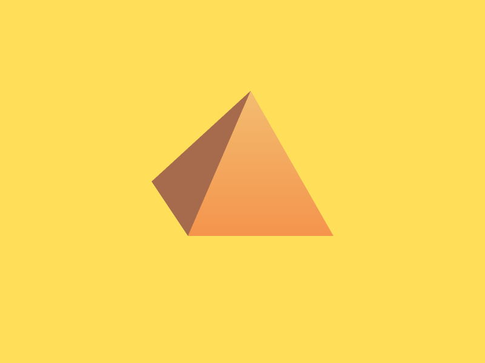

# Pertemuan 3 (15 Oktober 2020)

## Media Pembelajaran
Google Meet & Visual Studio Code Live Share

## Target Tercapai
Berhasil menggambar menggunakan 7 konsep menggambar primitif. Di bawah ini adalah beberapa penjelasan tiap konsep gambar primitif disertai hasil *output* yang diharapkan:

### gl.POINTS
Menggunakan **gl.POINTS**, kita dapat membuat titik-titik di bagian yang berbeda di atas *canvas*. Koordinat titik-titik tersebut menggunakan koordinat dalam *clip space*, dimana ujung kiri hingga ujung kanan (atau ujung bawah ke ujung atas) terbentang dari nilai **-1** hingga **1**.

### gl.LINES
Kita tahu bahwa garis(*edge*) terdiri dari gabungan 2 titik(*vertex*/*vertices*). **gl.LINES** menggunakan konsep ini, hingga kita perlu memasukkan 2 titik untuk membuat 1 garis, 4 titik untuk membuat 2 garis, atau **2n** titik untuk menggambar sejumlah **n** titik.

### gl.LINE_LOOP
Mirip dengan gl.LINES, **gl.LINE_LOOP** mengambil titik-titik yang terdapat di atas *canvas* untuk membuat garis yang menyambungkan titik-titik tersebut. **gl.LINE_LOOP** mengambil titik yang paling pertama ditulis kemudian dihubungkan dengan titik berikutnya. Titik yang terakhir ditulis akan dihubungkan kembali pada titik yang pertama(*loop*).

### gl.LINE_STRIP
***gl.LINE_STRIP*** mirip dengan gl.LINE_LOOP, hanya saja tidak berlaku konsep *loop*. Sehingga, apabila ingin membuat bidang, titik terakhir harus menuliskan ulang titik pertama atau titik awal dari bidang yang digambar.

### gl.TRIANGLE_STRIP
**gl.TRIANGLE_STRIP** merupakan konsep gambar primitif yang dapat kita gunakan untuk membuat bidang. Berbeda dengan gl.LINES, gl.LINE_LOOP, dan gl.LINE_STRIP, **gl.TRIANGLE_STRIP** sudah termasuk dengan pewarnaan di bidang(*face*) yang dibuat.

### gl.TRIANGLE_FAN
**gl.TRIANGLE_FAN** mengambil konsep *fan* atau kipas dalam penggambaran bidang. Alih-alih menggunakan titik yang berbeda untuk menggambar bidang yang lengkap, **gl.TRIANGLE_FAN** menggunakan titik awal sebagai pusat, sama seperti sebuah kipas yang memiliki 1 titik pusat dan menghasilkan banyak segitiga dari titik pusat tersebut.

#### Perbedaan Gl.TRIANGLE_STRIP dan Gl.TRIANGLE_FAN:

### gl.TRIANGLES
**gl.TRIANGLES**, sesuai dengan namanya, adalah konsep gambar primitif yang diperuntukkan untuk membuat segitiga. Seperti yang kita tahu, segitiga terbuat dari 3 titik yang berbeda dan saling tersambung oleh garis. Oleh karena itu, penerapan konsep ini membutuhkan 3 masukan titik untuk digabungkan satu sama lain dan membuat bidang datar berupa segitiga.

Selain penggambaran menggunakan konsep primitif, pertemuan kali ini juga membahas mengenai pemberian warna yang dapat dilakukan menggunakan beberapa blok yang berbeda pada CPU untuk dimasukkan pada satu blok **ARRAY_BUFFER**. Hal ini memungkinkan terjadinya pewarnaan yang berbeda pada tiap titik sehingga dapat menimbulkan warna gradasi pada bidang yang sedang digambar.

## Keluaran Pembelajaran
Keluaran(*output*) di bawah ini merupakan urutan dari penggambaran yang paling sederhana hingga penggambaran yang saya coba sendiri(Pyramid):

Hasil akhir kode *Javascript* dapat dilihat [di sini](main.js) dan dapat ditampilkan menggunakan kode html [di sini](index.html).

## Kesulitan
Kesulitan terjadi pada awal pembelajaran karena mengenal konsep baru dalam penggambaran primitif. Mengenal penggunaan pointer dan penggambaran titik yang berbeda menggunakan array pada GPU.